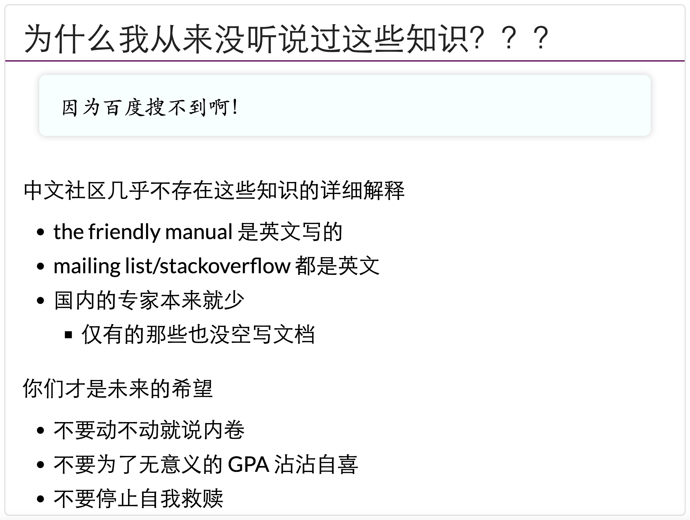
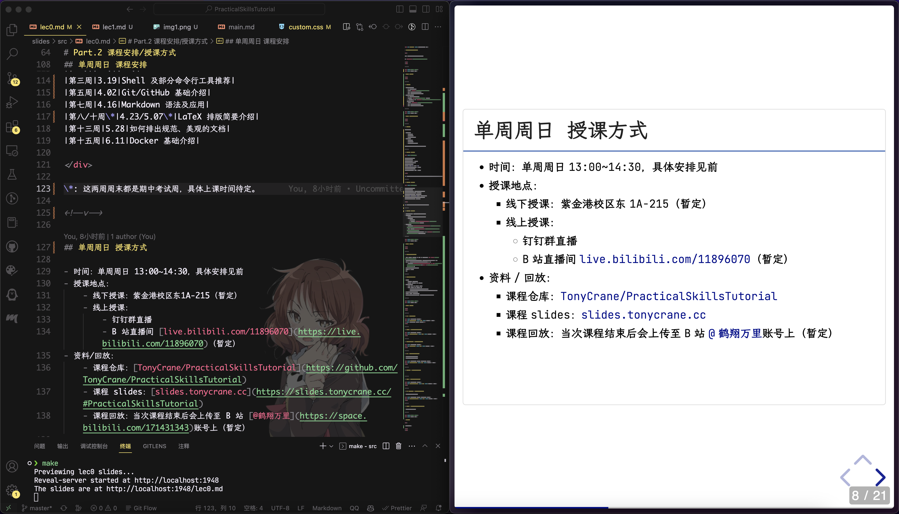
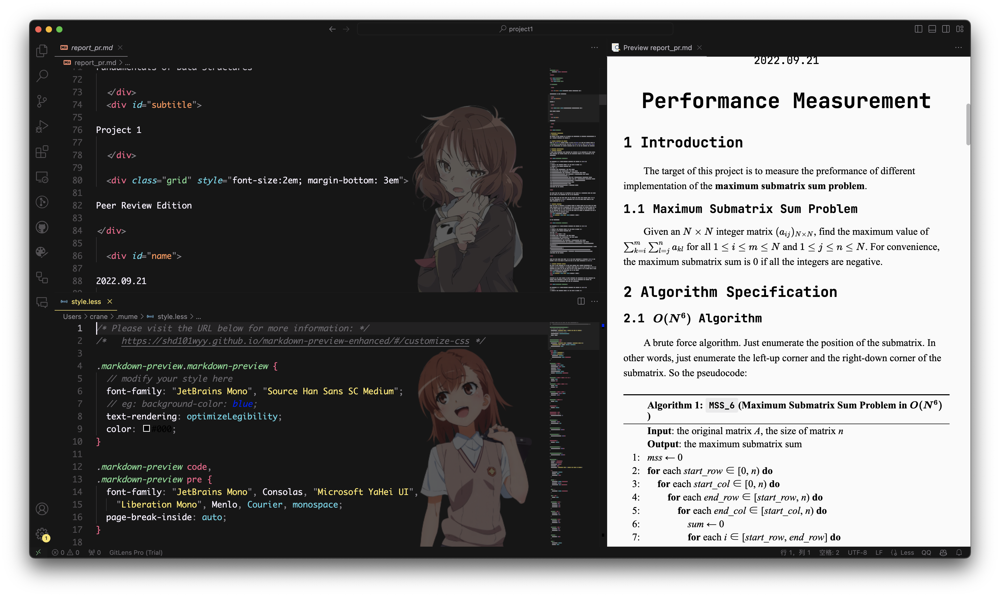
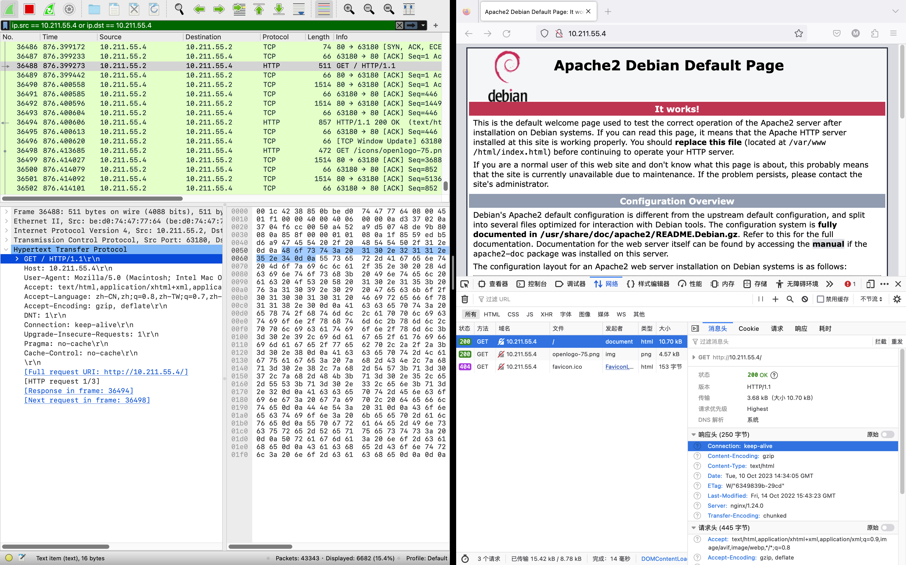

<!-- .slide: data-background="lec0/cover.png" -->

<!--s-->
<!-- .slide: data-background="lec0/background.png" -->

# Part.1 课程背景

<!--v-->
<!-- .slide: data-background="lec0/background.png" -->

## 为什么会有这门课程？

- "The Missing Semester of Your CS Education": [MIT 6.null](https://missing.csail.mit.edu/)

> 大学里的计算机课程通常专注于讲授从操作系统到机器学习这些学院派的课程或主题，而对于如何精通工具这一主题则往往会留给学生自行探索。在这个系列课程中，我们讲授命令行、强大的文本编辑器的使用、使用版本控制系统提供的多种特性等等。学生在他们受教育阶段就会和这些工具朝夕相处（在他们的职业生涯中更是这样）。
>
> 因此，花时间打磨使用这些工具的能力并能够最终熟练地、流畅地使用它们是非常有必要的。
> 
> 精通这些工具不仅可以帮助您更快的使用工具完成任务，并且可以帮助您解决在之前看来似乎无比复杂的问题。

<!--v-->
<!-- .slide: data-background="lec0/background.png" -->

## 为什么会有这门课程？

- 南京大学[蒋炎岩](https://jyywiki.cn/) 2020 秋《计算机系统基础》「链接与加载选讲」
    - https://jyywiki.cn/ICS/2020/slides/8.slides.html#/4/1

 

- “你们有没有想过为什么你们上的这么痛苦”
- “很长时间里面你们都被困在墙内”
- “你们 missed 可能要比 MIT 的那个还要再多一点”
- “另外一个就是你们的悲喜在很多情况下是在 GPA 上的”

<!--v-->
<!-- .slide: data-background="lec0/background.png" -->

## 在这门课程中你将有什么收获？

- 掌握一系列常用、好用的工具（包括 Git、Vim、Shell、Markdown 等）
- 增强 CS 专业技能，让你看起来更专业、更像一个 CS 人
    - 推荐阅读：[「如何让自己看上去、闻上去都像一个 CS 人」](https://blog.hobbitqia.cc/p/5948019b.html)（[CC98 版](https://www.cc98.org/topic/5370849)）
    - 树立起一个 CS 人的思维方式：
        - 学会自己解决问题、自己 debug
        - 学会探索计算机世界、广泛自学的方法
        - 构建一个属于自己、干净、高效的工作环境和工作流程
- 为将来更多计算机课程的学习打下坚实基础、打通道路
- 培养对 CS 的兴趣
- ...

<!--v-->
<!-- .slide: data-background="lec0/background.png" -->

## 以往的课程

2023 年春夏学期计算机学院朋辈辅学计划「实用技能拾遗」课程

|课程|幻灯片|回放|
|:--|:--|:--|
|lec0：课程前瞻|[lec0](https://slides.tonycrane.cc/PracticalSkillsTutorial/2023-spring-cs/lec0/)|/|
|lec1：Shell 基础及 CLI 工具推荐|[lec1](https://slides.tonycrane.cc/PracticalSkillsTutorial/2023-spring-cs/lec1/)|[BV1T84y1w7wB](https://www.bilibili.com/video/BV1T84y1w7wB/)|
|lec2：Git/GitHub 基础介绍|[lec2](https://slides.tonycrane.cc/PracticalSkillsTutorial/2023-spring-cs/lec2/)|[BV1og4y1u7XU](https://www.bilibili.com/video/BV1og4y1u7XU/)|
|lec3：Markdown 语法及应用|[lec3](https://slides.tonycrane.cc/PracticalSkillsTutorial/2023-spring-cs/lec3/)|[BV1Ts4y1N7tu](https://www.bilibili.com/video/BV1Ts4y1N7tu/)|
|lec4：LaTeX 排版简要介绍|[lec4](https://slides.tonycrane.cc/PracticalSkillsTutorial/2023-spring-cs/lec4/)|[BV12k4y1s7Y3](https://www.bilibili.com/video/BV12k4y1s7Y3/)|
|lec5：如何排出规范、美观的文档|*Canceled*|||
|lec6：Docker 基础介绍|*Canceled*|||

<!--s-->
<!-- .slide: data-background="lec0/background.png" -->

# Part.2 课程安排

<!--v-->
<!-- .slide: data-background="lec0/background.png" -->

## 关于讲师

- TonyCrane
    - 21 级图灵班信息安全专业
    - 浙江大学 [AAA](https://zjusec.com/) 战队成员
    - B 站知识区 up 主 [@鹤翔万里](https://space.bilibili.com/171431343)（绝赞停更中）
    - GitHub [@TonyCrane](https://github.com/TonyCrane)
    - 主页 https://tonycrane.cc/
    - 笔记 https://note.tonycrane.cc/
- 45gfg9
    - 22 级图灵班信息安全专业
    - 浙江大学 [AAA](https://zjusec.com/) 战队成员
    - GitHub [@45gfg9](https://github.com/45gfg9/)
    - 主页 https://45gfg9.net/

<!--v-->
<!-- .slide: data-background="lec0/background.png" -->

## 内容与时间安排

|课程|日期|讲师|
|:--|:--|:--|
|lec0：前瞻：通往 Pro 的第一步|10.14（秋四周）|TonyCrane|
|lec1：Shell 基础及 CLI 工具推荐|10.22（秋五周）|45gfg9|
|lec2：Git/GitHub 及开源基础|11.05（秋七周）|TonyCrane|
|lec3：Markdown 语法及应用|11.19（冬一周）|TonyCrane|
|lec4：LaTeX 排版简要介绍|12.03（冬三周）|45gfg9|
|lec5：如何排出规范、美观的文档|12.17（冬五周）|TonyCrane|
|lec6：网络/网站基础知识概述|12.31（冬七周）|45gfg9|

*时间均为暂定，上课前一周会确定具体时间并通知

<!--v-->
<!-- .slide: data-background="lec0/background.png" -->

## 资料与回放

- 课程仓库：[TonyCrane/PracticalSkillsTutorial](https://github.com/TonyCrane/PracticalSkillsTutorial)
- 课程主页：[slides.tonycrane.cc/PracticalSkillsTutorial](https://slides.tonycrane.cc/PracticalSkillsTutorial/)
- 本期课程主页：[*...*/2023-fall-ckc](https://slides.tonycrane.cc/PracticalSkillsTutorial/2023-fall-ckc/)
- 课程直播：B 站 [@鹤翔万里](https://live.bilibili.com/11896070)直播间（感谢竺院全媒体中心和学指的设备支持）
- 课程回放：当次课程结束后会上传至 B 站 [@鹤翔万里](https://space.bilibili.com/171431343)账号上

<!--s-->
<!-- .slide: data-background="lec0/background.png" -->

# Part.3 内容前瞻

<!--v-->
<!-- .slide: data-background="lec0/background.png" -->

## Terminal/Shell - 用命令行控制电脑

<!--v-->
<!-- .slide: data-background="lec0/background.png" -->

## Vim - 命令行中的文本编辑器

<!--v-->
<!-- .slide: data-background="lec0/background.png" -->

## Git - 版本控制工具

lazygit

<!--v-->
<!-- .slide: data-background="lec0/background.png" -->

## GitHub - 全球最大的代码托管网站

<!--v-->
<!-- .slide: data-background="lec0/background.png" -->

## Markdown - 轻量级文本标记语言

<!--v-->
<!-- .slide: data-background="lec0/background.png" -->

## LaTeX - 纯代码式文档排版软件

<!--v-->
<!-- .slide: data-background="lec0/background.png" -->

## GNU Make - 自动化项目编译执行

<!--v-->
<!-- .slide: data-background="lec0/background.png" -->

## 文档排版基础教程 / 样式编写基础

<!--v-->
<!-- .slide: data-background="lec0/background.png" -->

## 计算机网络知识入门

<!--s-->
<!-- .slide: data-background="lec0/background.png" -->

# Part.4 在开始之前

<!--v-->
<!-- .slide: data-background="lec0/background.png" -->

## 了解你自己的电脑

- Linux
    - 应该有管理好自己电脑的信息
    - 权限？sudo？做一切事情之前要完全清楚自己在干什么
    - 环境变量是否干净？命令行环境加载？
    - 各种语言/工具的环境是否整洁、完备？
- Windows
    - 关于 C 盘？文件夹整理是否清晰？
    - 有没有安装“垃圾软件”？下载应用记得官网，避免“下崽器”
- macOS
    - 参考 Linux 和 Windows
    - 命令行操作逻辑和 Linux 非常类似

<!--v-->
<!-- .slide: data-background="lec0/background.png" -->

## 如何学习这门课程？

- 环境：
    - 推荐使用 Linux/macOS
    - Windows 推荐安装 WSL 或虚拟机
- 牢记两个缩写：
    - RTFM: Read The F**king Manual
    - STFW: Search The F**king Web
        - 百度搜索、百度知道、百度百科、CSDN？❌
        - 必应搜索、谷歌搜索、Wikipedia、GitHub、StackOverflow！✅
- 一定要自己进行实操❗️❗️❗️
- 还没有 GitHub 账号❓赶紧注册
- 不知道怎么运用魔法来上网❓98 上搜搜，这是不能公开碰的滑梯

<!--v-->
<!-- .slide: data-background="lec0/background.png" -->

## 树立硅基生物思维

- 计算机专业的目的：了解计算机上万物运行的逻辑

> 计算机一定是对的，未经测试的代码一定是错的

- 一切结果的产生都是有原因的（没有那么多玄学问题）
- 学会自己 debug：逐层抓问题的直接原因，对逐个可能进行排查

本课程中会体现的 CS 人的“味道”：

- 折腾环境和工具，构建自己熟悉且方便快捷的工作环境与工作流程
    - 一切重复性工作都可以交给计算机自动化完成
    - 没有合适的工具？自己写一个.jpg
- 用命令行控制电脑，用代码控制一切
- 版本控制，开源共享，共同合作
- 遇到问题可以自己 STFW RTFM RTFSC 进行 debug 分析解决

<!--s-->
<!-- .slide: data-background="lec0/ending.png" -->
