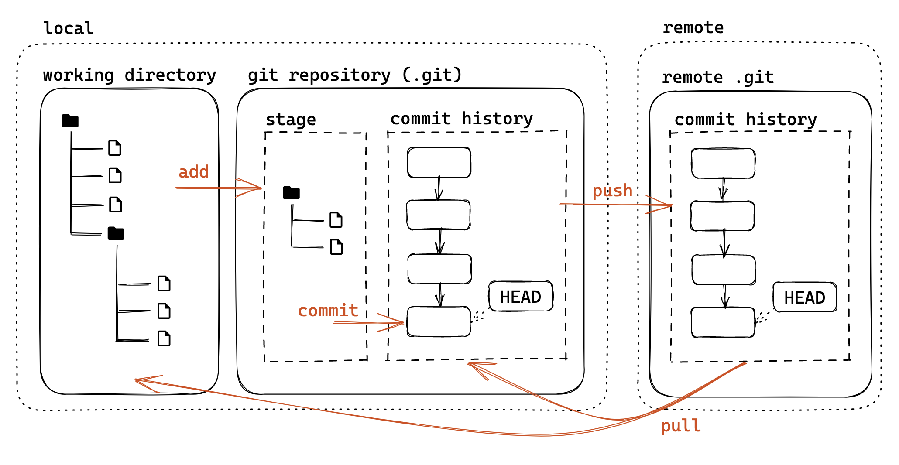
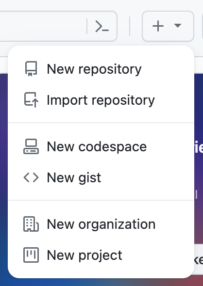
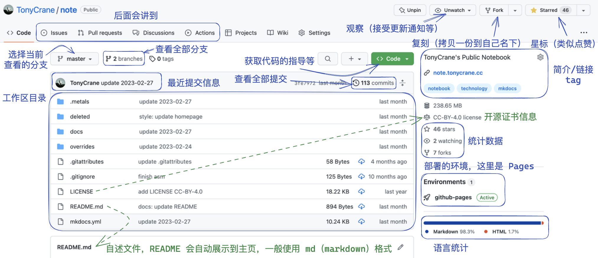
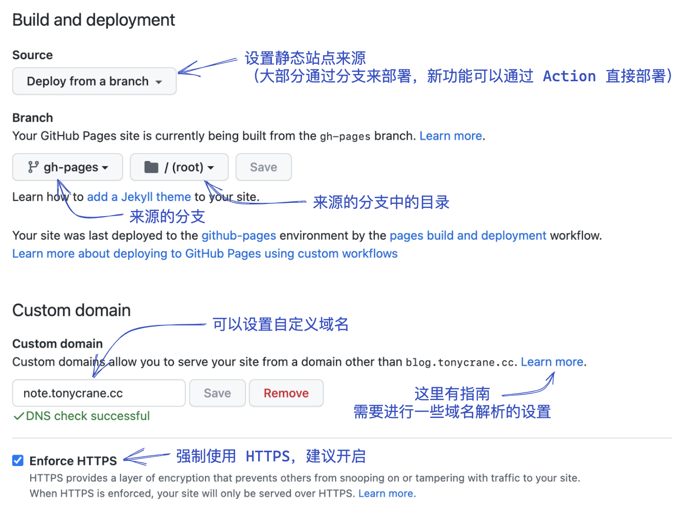
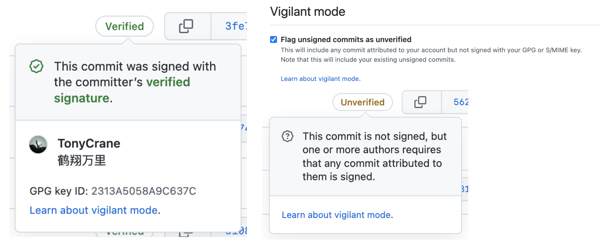

<div class="middle center">
<div style="width: 100%">


# lec2：Git&hairsp;&hairsp;/&hairsp;&hairsp;GitHub 基础介绍

<hr/>

2023 年春夏学期计算机学院朋辈辅学「实用工具拾遗」课程

By [@TonyCrane](https://github.com/TonyCrane)

<div style="text-align: right; margin-top: 1em;">
<p>2023.4.2&emsp;&emsp;&emsp;</p>
</div>

</div>
</div>

<!--v-->

## 本节内容

- Git
    - Git 基础：文件管理、提交 commit、分支 branch、合并 merge
    - Git 进阶：修改历史、变基 rebase、远程版本库
    - *略讲内容：子模块 submodule
- GitHub
    - GitHub 基本操作概述
    - issue 与 pull request
    - *略讲内容：GitHub Pages、GitHub Actions

（不会讲解 Git 安装、稳定访问 GitHub 等内容）

<!--v-->

## 我想让你 take-away 的内容

一些我在初学的时候没有了解到，但我希望通过我的讲解你可以了解到的内容

（也是我觉得很多人在讲授的时候可能缺少的我认为比较重要的内容）

- Git commit message 编写规范（Angular）
- 几种修改提交记录的方法
- 远程仓库与 GitHub 的本质
- GitHub 配置好邮箱的必要性
- GitHub Issue 与 Pull Request 的相关注意事项
- *签署 commit 的重要性


<!--v-->

## 如何自学本章节内容


- 《Git 版本控制管理》[ISBN 978-7-115-38243-6](http://oreilly.com.cn/index.php?func=book&isbn=978-7-115-38243-6)
    - [*Version Control with Git*](https://www.oreilly.com/library/view/version-control-with/9780596158187/), Jon Loeliger
- *Pro Git (2nd Edition)*, Scott Chacon, et al.
    - https://git-scm.com/book/zh/v2
    - https://git-scm.com/book/en/v2
- Git Reference: https://git-scm.com/docs
- [git-flight-rules](https://github.com/k88hudson/git-flight-rules/blob/master/README_zh-CN.md)
- 实操❗️实操❗️一定要实操❗️❗️
    - [Learning Git Branching](https://learngitbranching.js.org/?locale=zh_CN)
    - [Gazler/githug](https://github.com/Gazler/githug)

<!--s-->

<div class="middle center">
<div style="width: 100%">

# Part.1 什么是 Git？

</div>
</div>

<!--v-->

## 什么是 Git？

- 分布式版本控制系统（DVCS，Distributed Version Control System）
    - 分布式：不需要联网，在自己的机器上就可以使用
    - 版本控制：记录、管理、回溯文件的修改历史
- 官网：https://git-scm.com/
- 历史？
    - Linus Torvalds 在开发 Linux 内核时由于当时使用的分布式版本控制系统 BitKeeper 对于免费版本加入了限制，于是开发了一款免费自由而且解决了历代 VCS 缺陷的版本控制系统 Git
    - 2005.4.7，[Git 开始自托管](https://github.com/git/git/commit/e83c51633)；九天后，[Linux 转为使用 Git 作为 VCS](https://github.com/torvalds/linux/commit/1da177e4c)

<div style="text-align: center;">

</div>

<!--v-->

## Git 模型

<div style="text-align: center;">

</div>

<p style="font-size: 0.5em; opacity: 0.7;">
本 slides 中所有图片均使用 excalidraw 原创绘制，转载请注明来源
</p>

<!--v-->

## Git 基础配置

- 创建一个本地 git 版本库
    - 通过 git init 指令
        - git init：让当前文件夹变成 git 仓库（创建 .git 文件夹）
        - git init *folder*：创建一个新的文件夹并初始化为 git 仓库
- git 账号配置
    - Why？多人合作区分用户/让 GitHub 能够识别出你
    - 全局配置：
        - git config --global user.name "*name*"
        - git config --global user.email "*email*"
    - 针对某一版本库专门设置：
        - 同前，不加 --global

<!--s-->

<div class="middle center">
<div style="width: 100%">

# Part.2 Git 基础用法

</div>
</div>

<!--v-->

## 文件暂存


- 暂存区：已经修改、等待后续提交的文件
- 将文件加入暂存区：
    - git add *file/folder*
    - 只会添加修改过的文件
- 删除文件的几种情况：
    - 只在本地删除版本库中不存在的文件：rm
    - 同时删除本地和版本库中的文件：git rm / 先 rm 再 add
    - 将一个已暂存的新文件取消暂存：git rm --cached
- 重命名文件：git mv（等价于 mv + git rm + git add）
- 查看当前工作区和暂存区状态：git status
    - 文件三个类别：未跟踪（Untracked）、已追踪（Tracked）、被忽略（Ignored）

<!--v-->

## 提交更改


- 将暂存内容提交到本地仓库，生成一个新版本
    - git commit：默认编辑器编辑提交信息
    - git commit -m "*message*"
    - -a (--all) 自动暂存所有更改的文件
- 查看提交历史：git log
    - --oneline：每一个提交一行
    - --graph：显示分支结构
    - --stat：显示文件删改信息
    - -p：显示详细的修改内容
- 每个提交都有一个唯一的 sha-1 标识符（40 位十六进制数）
    - git show *id*：显示提交详细信息（*id* 在不重复前提下可以只写前几位）
- 检出之前的某一版本：git checkout *id*

<!--v-->

## 关于 commit message

- 意义是什么：记录更改的原因/内容，方便定位/回溯（特别是合作项目）
- Angular 规范（来源：[angular/angular:CONTRIBUTING.md](https://github.com/angular/angular/blob/main/CONTRIBUTING.md#-commit-message-format)）
    ```text
    <type>([scope]): <summary>

    [body]

    [footer]
    ```
    - type：更改类型（fix/feat/docs/refactor/perf/test/ci/...）
        - 重大更改可以写 BREAKING CHANGE 或 DEPRECATED（全大写）
    - scope：影响范围（可选，比如具体影响的模块等）
    - summary：更改的简要描述，英文一般现在时，首字母小写句末无句号
    - body：详细描述，可选
    - footer：解决 issue 了可以写 Fixes #*id* 或 Closes #*id*

<!--v-->

## detached HEAD 问题

- 什么是 HEAD：当前工作区在提交历史中的指针
- 什么是 detached HEAD：HEAD 指向某个历史提交，而不是某个“分支”
- 什么情形会出现 detached HEAD
    - git checkout *id*，此后的修改不会出现在任何分支
    - 切换回 master 后会出现一条不属于任何分支的提交（相当于修改会丢失）

<div style="text-align: center; margin-top: 10px;">

</div>

- 如何解决：在 F 的位置上 git checkout -b *branch* 创建新分支

<!--v-->

## 分支

- git branch
    - git show-branch
- ref / ^~
- git checkout
- git diff

<!--v-->

## 合并

- git merge
- merge conflict
- git merge-base (?)
- merge commit
    - fast-forward / already up-to-date (?)
- squash merge
- -> GitHub

<!--s-->

<div class="middle center">
<div style="width: 100%">

# Part.3 Git 进阶用法

</div>
</div>

<!--v-->

## 修改提交历史

- git reset (soft/mixed/hard)
- git revert
- git commit --amend

<!--v-->

## rebase 变基

- git rebase -i
    - pick edit squash drop

<!--v-->

## 远程版本库

- 远程版本库概念/模型
- 裸版本库/权威版本库
- git remote 设置
- git push
- git fetch / git pull
- non-fast-forward
- -> GitHub

<!--v-->

## *submodule 子模块

- git submodule add
- git submodule update
- git submodule status

<!--s-->

<div class="middle center">
<div style="width: 100%">

# Part.4 GitHub 基本操作与项目协作

</div>
</div>

<!--v-->

## GitHub 基本操作

- 首先，推荐一个浏览器插件：[Refined GitHub](https://github.com/refined-github/refined-github)
- 创建账号、基本的设置不再赘述
- 一个非常重要的设置：
    - Settings > Access > Emails，一定要设置为 git 配置的邮箱
    - 为什么？想一想 GitHub 作为一个远程版本库的托管平台，它如何将版本库中每个提交的提交者关联到 GitHub 用户？

<div style="text-align: center;">

</div>

<!--v-->

## GitHub 基本操作（续）



- 创建（如右图）
    - new repository 新存储库（import 从链接导入）
    - new codespace 新代码空间（新功能）
    - new gist 代码片段（类似剪贴板）
    - organization 组织、project 项目计划面板
- 关于 repo

<div style="text-align: center; margin-top: -10px;">

</div>

<!--v-->

## GitHub 项目协作

- issue
    - 几种内容：反馈 bug、提出新功能、寻求帮助等
    - 可以、而且建议使用 markdown 语法（特别是涉及到代码块的时候）
    - 一些原则：
        - 项目有明确规范/模板的时候请按照要求来写
        - 在提 issue 前先搜索有没有已有的类似 issue
        - 反馈 bug 时提供足够的信息，包括代码、错误、环境等
    - 如果自己开的 issue 已经解决或者不存在，请自行关闭
- discussion
    - GitHub 新推出的板块，目前少部分项目会启用
    - 类似帖子/社区，要比 issue 更随意很多，话题范围也更广
    - 但也同样，请遵守规范，提问请提供足够信息

<!--v-->

## GitHub 项目协作（续）

<div style="text-align: center;">

</div>

- pull request（PR）
    - 对于他人的 repo，你是没有办法直接 push 的，向其中添加代码更改都是通过 pull request 进行的
    - 在提 pull request 的前**一定**要阅读贡献守则
    - 提 PR 要按照要求写好标题和描述，修改的内容不要附带无用内容
        - 如果解决了某 issue 的 bug 的话，描述中最好加上 fix/close #*issue_number* 这样的内容，会自动链接并在 PR merge 之后自动关闭 issue
    - 一个 PR 中不要包含多个不相关的修改，如果有多个修改，应该分别提 PR
    - 有些项目会自动进行 CI，如果 CI 未通过，请检查错误信息并修改

<!--v-->

## GitHub 项目协作（续）

- pull request（续）
    - 对于自己有权限修改的项目，也建议使用 PR 进行修改，这样更清晰
        - 这时不必通过 fork 的方式，直接新建分支并修改即可
    - review
        - 即有权限的人对 PR 进行审查，提出意见
        - review 可以针对某一行/几行代码进行
        - 收到 change request 后，请按要求进行修改
        - 一般的项目在 review 通过后才会 merge
    - merge
        - 几种方式：merge commit、squash merge、rebase merge
        - 要求线性 log 的项目要使用 squash（一个 PR 就是一个 commit）
        - 可能会出现冲突，需要手动解决（通过 GitHub 或者根据指导在本地命令行进行）

<!--v-->

## GitHub 项目协作（续）

关于向已有 pull request 添加修改的几种常见情况

- 向自己开启的 PR 中继续添加修改
    - 直接在源分支中继续修改即可同步到 PR 中
    - 所以在开 PR 之后、merge 之前请不要随意删除源分支，也不要继续向其中添加无关修改
- 向他人开启的 PR 中添加修改
    - 你有目标分支的写（write）权限
        - 可以直接在 GitHub 中进行编辑，这时修改也会同步到 PR 中
        - 也可以本地修改后 push 到源分支
            - 推荐使用 GitHub CLI：gh pr checkout *pr_number*
            - 直接 push 会有错误，但 git 会提示正确方式：git push *source_branch_url* HEAD:master
    - 没有写权限：建议只提出修改建议，或再向源分支发起 PR

<!--s-->

<div class="middle center">
<div style="width: 100%">

# Part.5 GitHub 进阶用法

</div>
</div>

<!--v-->

## *GitHub Pages

- GitHub 会为每个用户/组织分配一个二级域名 *username*.github.io
- 可以创建一个名为 *username*.github.io 的 repo，会作为主页，通过 *username*.github.io 即可访问 repo 内存放的静态网页
- 对于其他 repo，也可以开启 Pages 功能，通过 *username*.github.io/*repo_name* 访问，静态页面来源也需要指定

<div style="text-align: center;">

</div>

<!--v-->

## *GitHub Actions

- GitHub 提供的 CI/CD 服务
    - CI（Continuous Integration）：持续集成
    - CD（Continuous Delivery）：持续交付
- 即配置一些自动化任务，在特定事件发生时自动执行
    - 比如说每次 push 后自动测试，release 时自动构建部署
- 如何说明怎么执行任务
    - 通过配置文件，文件名为 .github/workflows/*workflow_name*.yml
    - 如何写这个配置文件：
        - 在 GitHub 上编写会有提示
        - GitHub 文档：https://docs.github.com/en/actions
        - [GitHub Action 精华指南](https://zhuanlan.zhihu.com/p/164744104)、[GitHub Actions 入门教程 - 阮一峰](https://www.ruanyifeng.com/blog/2019/09/getting-started-with-github-actions.html)
        - ❗️建议自己建一个 repo，编写一些 workflow，在尝试中学习

<!--v-->

## *签署 commit

- 为什么建议签署 commit
    - ["delete linux because it sucks"](https://github.com/torvalds/linux/tree/8bcab0346d4fcf21b97046eb44db8cf37ddd6da0)
    - 回忆一下 GitHub 是如何关联 committer 和 GitHub 账号的
    - 只要有了你提交使用的 email，别人就可以伪造你进行 commit
- 如何通过 GPG 签署 commit：[GitHub 文档](https://docs.github.com/en/authentication/managing-commit-signature-verification/signing-commits)
    - [GitHub 中提交 commit 时使用 GPG 进行签名](https://www.ffis.me/archives/1791.html)
- 带有签名的 commit 在验证后会显示为 Verified，如果开启了 vigilant mode，则没有通过验证的 commit 会标记为 Unverified

<div style="text-align: center;">

</div>

<!--s-->

<div class="middle center">
<div style="width: 100%">

# Part.6 Git 相关工具/资源

</div>
</div>

<!--v-->

## Git 相关工具/资源

Git 相关工具

- gitui
- lazygit
- gitoxide

Git 学习资源

- 《Git 版本控制管理》[ISBN 978-7-115-38243-6](http://oreilly.com.cn/index.php?func=book&isbn=978-7-115-38243-6)
    - [*Version Control with Git*](https://www.oreilly.com/library/view/version-control-with/9780596158187/), Jon Loeliger, et al.
- *Pro Git (2nd Edition)*, Scott Chacon, et al.
    - https://git-scm.com/book/zh/v2
- [git-flight-rules](https://github.com/k88hudson/git-flight-rules/blob/master/README_zh-CN.md)
- [Learning Git Branching](https://learngitbranching.js.org/?locale=zh_CN)
- [Gazler/githug](https://github.com/Gazler/githug)

<!--s-->

<div class="middle center">
<div style="width: 100%">

# 谢谢大家

<hr/>

**Questions?**

</div>
</div>